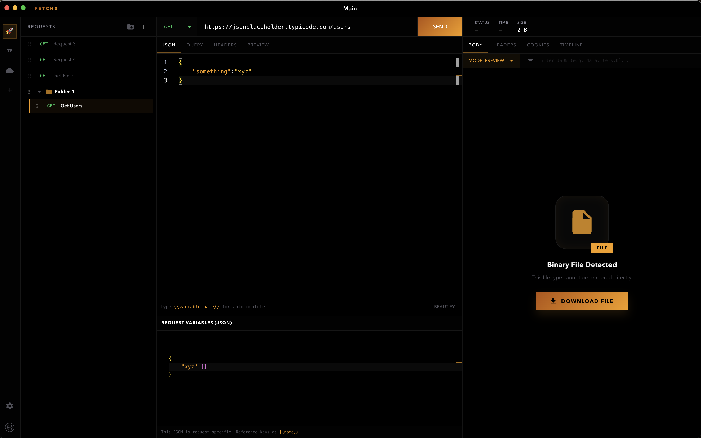
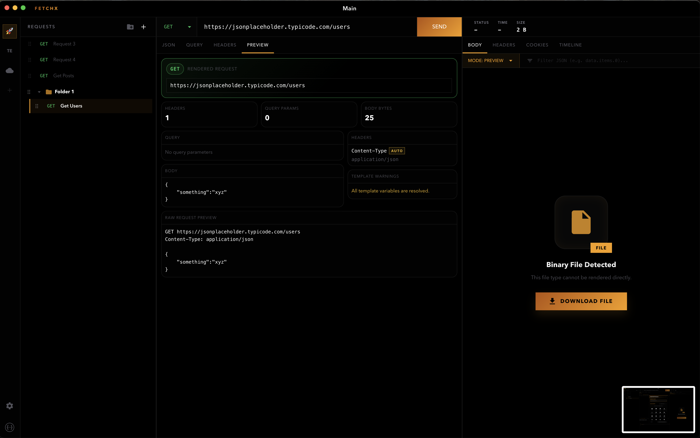
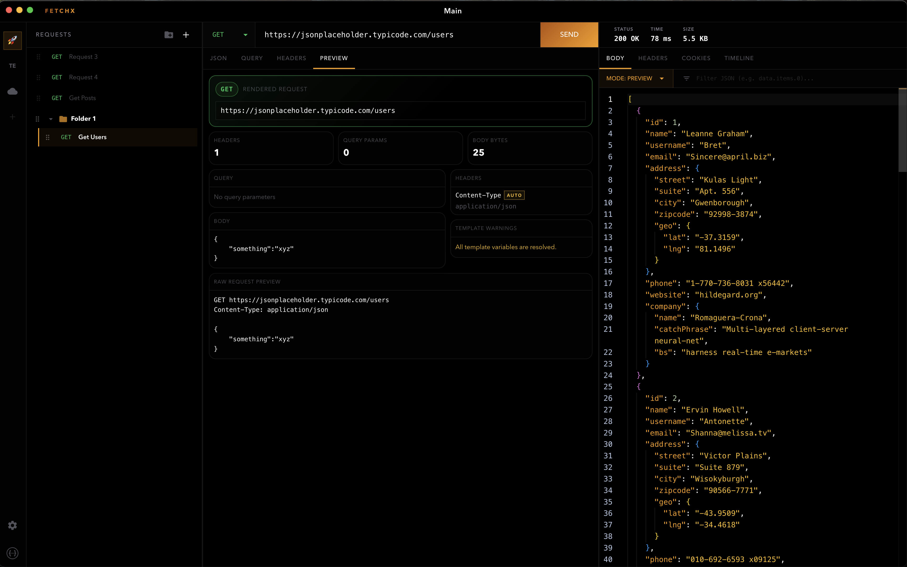
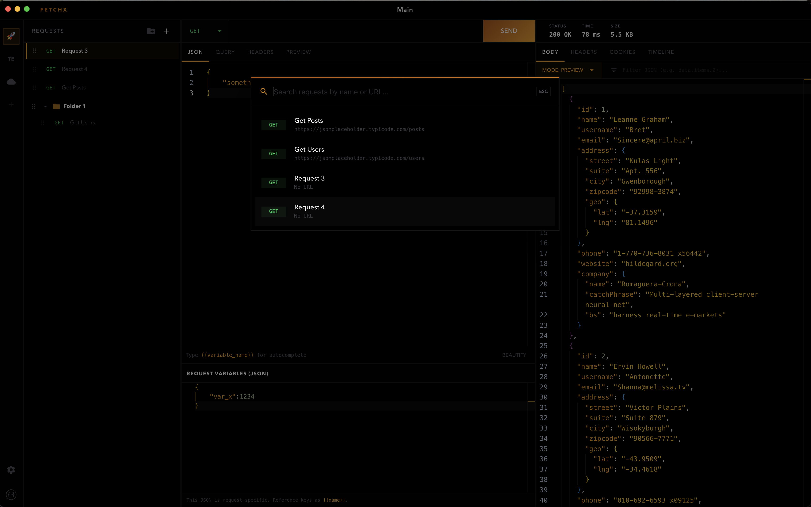
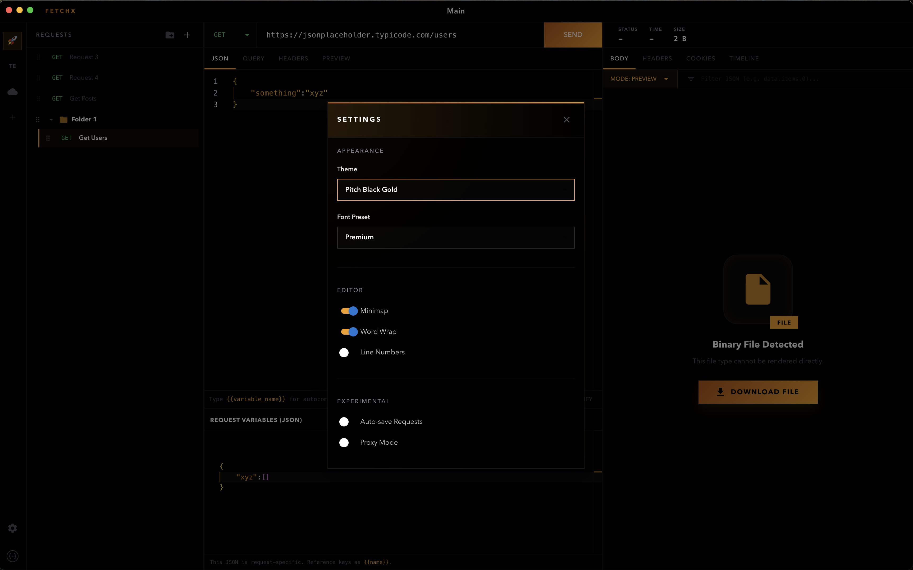
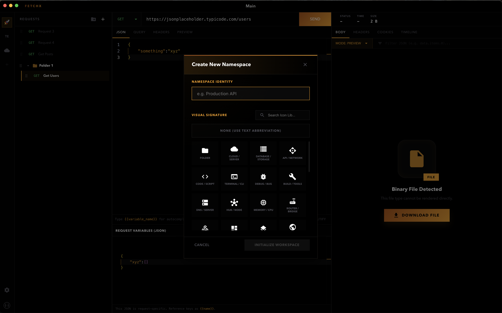
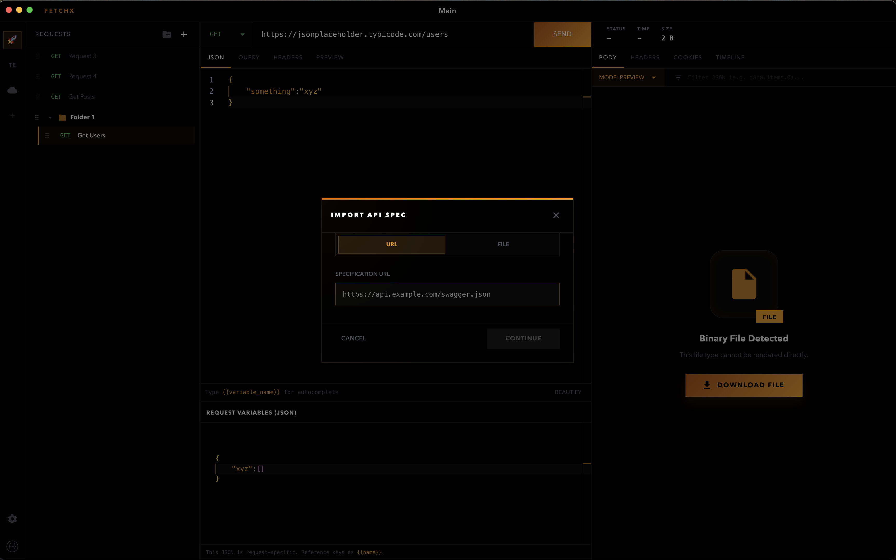

# FetchX

Desktop API client built with Electron + React for composing requests, previewing payloads, and inspecting responses.


## Built by
**Developed by Ahmad Baderkhan <ahmad@baderkhan.org>**

## What FetchX includes
- Multi-namespace workspaces with custom icons.
- Request folders + drag-and-drop request organization.
- HTTP methods: `GET`, `POST`, `PUT`, `PATCH`, `DELETE`, `HEAD`.
- Composer tabs for JSON body, query params, headers, and a final request preview.
- Template variables like `{{token}}` with autocomplete/validation in composer fields.
- Quick search modal with `Cmd/Ctrl + P`.
- Response tabs for body, headers, cookies, and request timeline.
- JSONPath filtering for JSON responses.
- Body rendering modes for JSON/text, image, video, CSV table, PDF, HTML, and binary download fallback.
- OpenAPI/Swagger import from URL or local JSON/YAML.
- OpenAPI namespace refresh (for URL-imported specs).
- Local app-state persistence through Electron (`electron-store`).

## Screenshots
### Main workspace


### Request preview


### Response inspector


### Search dialog


### Settings dialog


### Create namespace


### Import API spec (This includes swagger)


## Run locally
### Prerequisites
- Node.js
- npm

### Start development app (Vite + Electron)
```bash
npm install
npm run dev:all
```

### Build frontend bundle
```bash
npm run build
```

### Makefile shortcuts
```bash
make install
make dev
make build
```

## Tech stack
- Electron
- React 18
- Vite
- Material UI
- Monaco Editor
- `@hello-pangea/dnd`
- `js-yaml`
- `jsonpath-plus`

## Future work
- [ ] GraphQL support
- [ ] WebSocket support
- [ ] Global variables
- [ ] Import requests from Postman / Insomnia
- [ ] Request/response history

## License
MIT. See [LICENSE](LICENSE).
