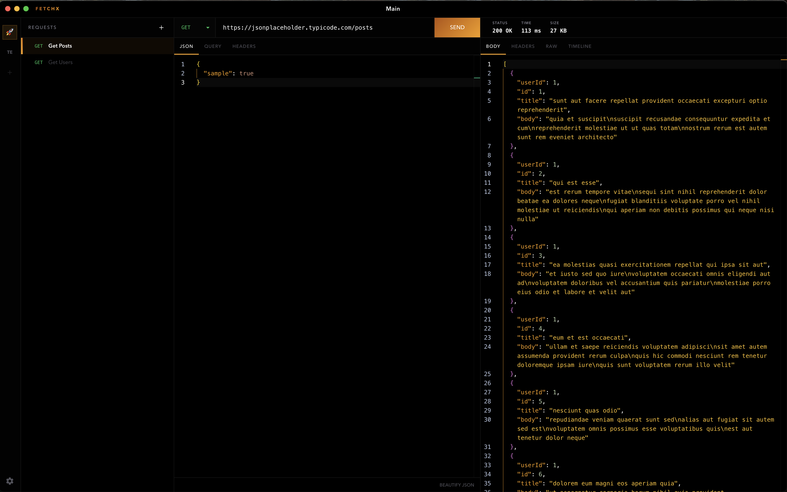
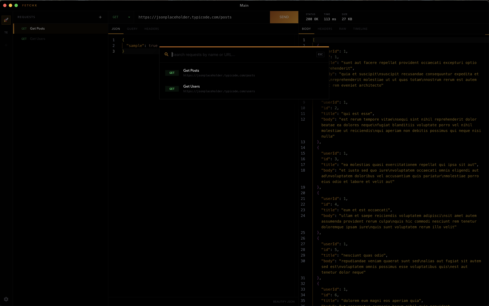

# FetchX: Pitch Black Obsidian

**The Ultra-Premium API Client for macOS.**  
Absolute Black. High Performance. Pure Focus.

---



## 🌑 Obsidian Design System
FetchX is built for engineers who demand absolute visual clarity. Every interface element is locked to **#000000 Pitch Black**, providing the highest possible contrast for your request data and eliminating UI distraction.

## 🚀 Native Contexts
### Namespace Isolation
Stop mixing your production logs with test data. **Namespaces** provide a full context switch for your workflow.
- **Physical Isolation**: Each namespace maintains its own requests, history, and active state.
- **Visual Identifiers**: Customize your workspace with professional icons or text-based abbreviations.
- **Integrated Explorer**: A searchable Material Icon library to define your environment's signature.



### Command Palette ($⌘K$)
Navigate your workspace at the speed of thought. The command palette features:
- **Aggressive Focus**: Refocuses automatically to ensure you never miss a keystroke.
- **Shimmering Headers**: Animated spectral gradients represent different system levels.
- **Deep Search**: Instant filtering across all request names and URLs.

## 🎨 Professional Polish
- **Custom Title Bar**: Bespoke window controls integrated with macOS traffic lights.
- **Monaco Editor**: Industrial-grade JSON editing with full diagnostics and syntax highlighting.
- **Geist Typography**: Utilizing Vercel's Geist font for maximum readability in high-density environments.
- **Gradient Accents**: Living UI accents that pulse with the Pitch Black Obsidian theme.

---

## 🛠 Usage

### Launch on macOS
```bash
# Enter the project
cd FetchX/fetchx-react

# Instantiate and Run
make mac
```

### Development
- `make install` — Install Nexus dependencies
- `make dev` — Run Vite + Electron Development environment
- `make build` — Compile production React bundle

---

<p align="center">
  <strong>Built with Focus. Driven by Design.</strong>
</p>
